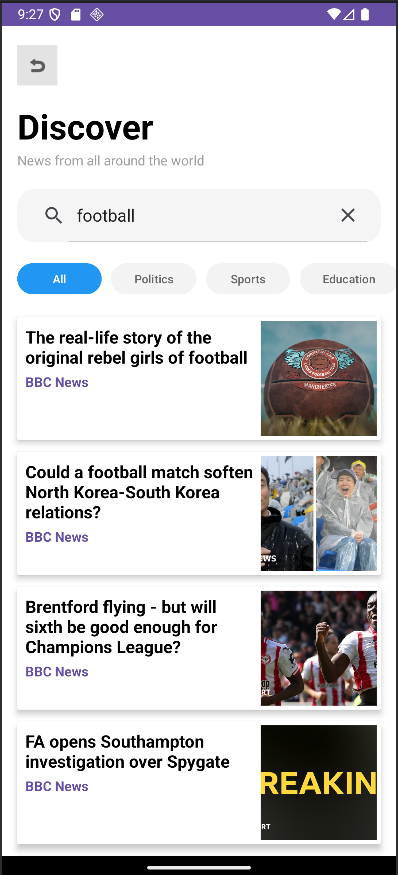

# 📰 News App Android

A modern Android News Application built using Java, Retrofit, and NewsAPI. The app allows users to browse the latest news headlines, search for articles, filter news by category, and read detailed news content through a clean and responsive interface.

---

## ✨ Features

* Browse latest news headlines
* Search news articles by keyword
* Category-based news filtering

  * Business
  * Entertainment
  * General
  * Health
  * Science
  * Sports
  * Technology
* Detailed article view
* RecyclerView-based news feed
* Modern Discover-style UI
* Dynamic image loading
* Fast API integration using Retrofit

---

## 🛠 Tech Stack

* Java
* Android Studio
* RecyclerView
* Retrofit
* Gson Converter
* NewsAPI
* CardView
* Glide

---

## 📱 Screenshots

### Home Screen


### Search Screen



### Details Screen


---

## 📂 Project Structure

* MainActivity
* DetailsActivity
* CustomAdapter
* CustomViewHolder
* RequestManager
* NewsApiResponse
* NewsHeadlines
* Source
* SelectListener
* OnFaceDataListener

---

## 🚀 Installation

### Clone Repository

```bash
git clone https://github.com/Its-Souvik/News-App-Android.git
```

### Open Project

Open the project in Android Studio.

### Configure API Key

Add your NewsAPI key in:

```xml
app/src/main/res/values/strings.xml
```

```xml
<string name="api_key">YOUR_API_KEY_HERE</string>
```

### Run Application

Build and run the application on an Android device or emulator.

---

## 🔮 Future Improvements

* Dark Mode
* Bookmark Articles
* Share News
* Offline Caching
* Pagination
* Pull-to-Refresh
* Better Category Selection UI

---

## 👨‍💻 Author

**Souvik Ghosh**

GitHub: https://github.com/Its-Souvik

---

## ⭐ Support

If you found this project useful, consider giving it a star on GitHub.
